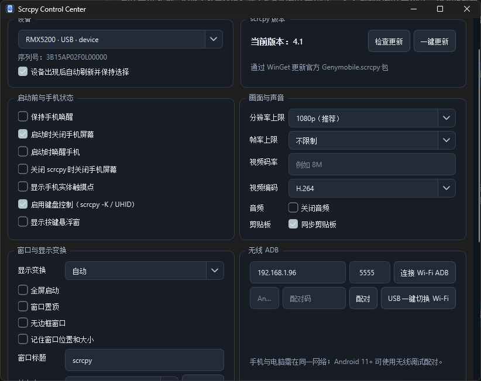

# Scrcpy Control Center

Scrcpy Control Center is a compact Windows frontend and launcher for the official
[Genymobile scrcpy](https://github.com/Genymobile/scrcpy). It keeps scrcpy's
original video window and adds a practical control panel for device discovery,
wireless ADB, launch options, updates, shortcuts, and independent app windows.

## Interface preview



## Features

- Prefers the scrcpy already installed on the computer; the bundled official
  scrcpy release is used only as a fallback in the single-file build.
- USB ADB device discovery with automatic refresh and selection persistence.
- Android 11+ wireless debugging pairing, Wi-Fi ADB connect, and USB-to-Wi-Fi
  switching helpers.
- Common resolution, frame-rate, bitrate, codec, audio, clipboard, and touch
  presets.
- Start/stop screen power options, wake-up options, and verified physical
  display state handling.
- Fullscreen, always-on-top, borderless, rotation, and mirror settings.
- Official scrcpy shortcuts for screen off/on (`Alt+O` and `Shift+Alt+O`) and
  UHID keyboard mode (`-K`).
- Optional floating toolbar that follows the scrcpy window.
- Independent app windows using `scrcpy --new-display`; Chinese app names are
  resolved through the official `scrcpy --list-apps` output.
- WinGet update check and one-click update for the official Genymobile.scrcpy
  package.
- Settings are saved automatically in the user's Windows settings store.

## Requirements

- Windows 10 or Windows 11.
- Python 3.11 or newer for development.
- A system installation of scrcpy and ADB, or the official scrcpy folder when
  using the portable/single-file distribution.

## Run from source

```powershell
py -3.13 -m venv .venv
.\.venv\Scripts\python.exe -m pip install -r requirements.txt
.\.venv\Scripts\python.exe .\scrcpy_gui.py
```

The GUI can also be started with `启动 Scrcpy 控制中心.cmd` when a built
executable is present.

## Build

The repository contains PyInstaller specifications for the normal, portable,
and single-file variants. Use the supplied helper on Windows:

```powershell
.\build.ps1 -Mode portable
.\build.ps1 -Mode single
```

The single-file build embeds the official scrcpy release found in the local
WinGet installation and produces `dist\ScrcpyControlCenterSingle.exe`. The
normal build is smaller and follows the system scrcpy installation at runtime.

## Tests

Run the offline regression suite with:

```powershell
.\.venv\Scripts\python.exe -m unittest discover -s tests -p "test_*.py"
```

The optional connected-device shortcut test is kept separate because it needs
an awake Android device and an explicit `SCRCPY_TEST_SERIAL` environment
variable.

## Known limitations

- Screen power behavior depends on the Android device exposing compatible
  display power commands. The frontend verifies the result and reports when a
  device does not support it.
- A protected Android password screen may intentionally block mirroring. This
  launcher does not bypass Android security restrictions.
- Independent virtual displays require Android 10+ and device support for
  `--new-display`.

## Distribution

The current Windows single-file build is published on the project's GitHub
[Releases page](https://github.com/caiyi0577/scrcpy-control-center/releases).
