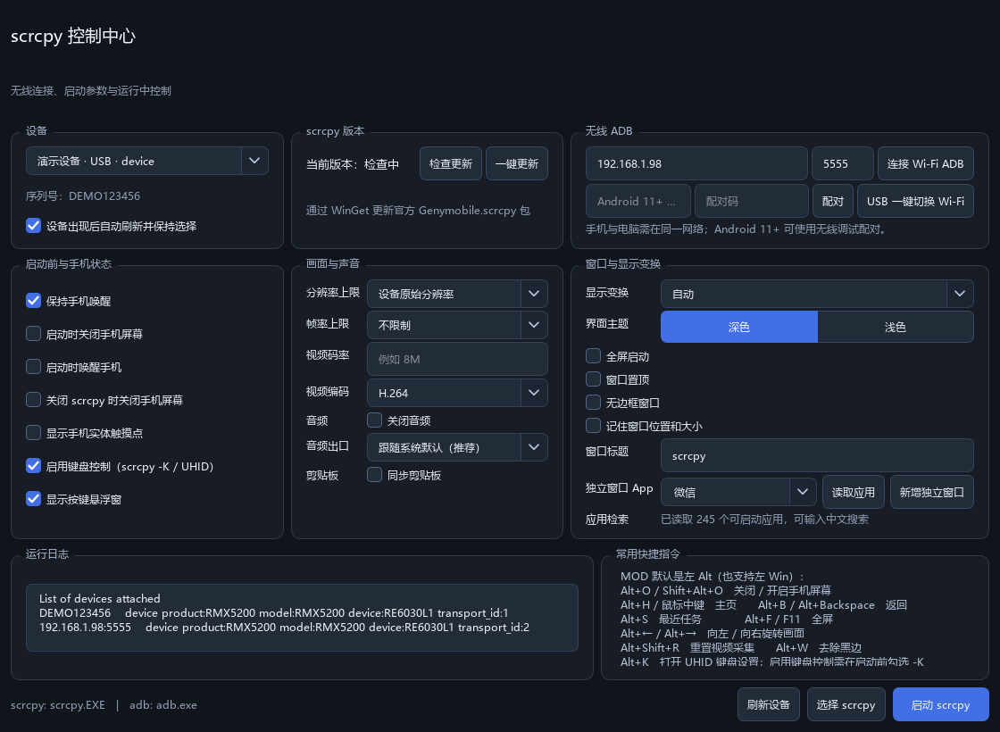

# Scrcpy Control Center

Scrcpy Control Center is a compact Windows frontend and launcher for the official
[Genymobile scrcpy](https://github.com/Genymobile/scrcpy). It keeps scrcpy's
original video window and adds a practical control panel for device discovery,
wireless ADB, launch options, updates, shortcuts, and independent app windows.

## Interface preview



## 中文说明

Scrcpy 控制中心是官方 [Genymobile scrcpy](https://github.com/Genymobile/scrcpy)
的 Windows 前端启动器。它保留 scrcpy 原本的手机画面窗口，并提供设备发现、无线
ADB、启动参数、更新、快捷指令和独立应用窗口等集中控制功能。

### 主要功能

- 优先使用电脑中已经安装的 scrcpy；Single 单文件版找不到系统版本时，会使用内置的官方 scrcpy。
- USB ADB 设备发现、自动刷新，以及设备选择记忆。
- Android 11+ 无线调试配对、Wi-Fi ADB 连接和 USB / Wi-Fi 快速切换。
- 分辨率、帧率、码率、编码、音频、剪贴板和触摸显示等常用预设。
- 音频出口选择：跟随系统默认、指定电脑播放设备，或 Android 13+ 手机端播放。
- 启动前后手机屏幕控制、保持唤醒、屏幕关闭和唤醒选项。
- 全屏、置顶、无边框、旋转和镜像设置。
- 深色 / 浅色分段按钮主题切换，复选框和下拉控件会同步适配主题。
- 官方快捷键，包括关闭 / 开启手机屏幕（`Alt+O` / `Shift+Alt+O`）和 UHID 键盘模式（`-K`）。
- 可选按键悬浮窗，并跟随 scrcpy 窗口在不同显示器之间移动。
- 独立应用窗口：使用 `scrcpy --new-display` 创建互不影响的窗口；窗口标题会显示为
  `scrcpy·应用名`，例如 `scrcpy·微信`。
- 通过 WinGet 检查并一键更新官方 Genymobile.scrcpy 软件包。
- 所有勾选项和输入设置会自动保存，下次启动继续使用。

### 运行要求

- Windows 10 或 Windows 11。
- 使用源码运行或自行构建时，需要 Python 3.11 或更高版本。
- 系统中已安装 scrcpy 和 ADB；或者使用内置官方 scrcpy 的 Single 单文件版。

### 从源码运行

```powershell
py -3.13 -m venv .venv
.\.venv\Scripts\python.exe -m pip install -r requirements.txt
.\.venv\Scripts\python.exe .\scrcpy_gui.py
```

也可以在存在构建程序时双击 `启动 Scrcpy 控制中心.cmd`。

### 构建

项目提供普通、Portable 和 Single 三种 PyInstaller 配置。在 Windows 中运行：

```powershell
.\build.ps1 -Mode portable
.\build.ps1 -Mode single
```

Single 版本会将本机 WinGet 安装的官方 scrcpy 一起打包，生成
`dist\ScrcpyControlCenterSingle.exe`；普通 Final 版本体积更小，运行时优先使用系统中的 scrcpy。

### 下载

最新 Windows 版本请前往项目的 GitHub
[Releases 页面](https://github.com/caiyi0577/scrcpy-control-center/releases)。

## Features

- Prefers the scrcpy already installed on the computer; the bundled official
  scrcpy release is used only as a fallback in the single-file build.
- USB ADB device discovery with automatic refresh and selection persistence.
- Android 11+ wireless debugging pairing, Wi-Fi ADB connect, and USB-to-Wi-Fi
  switching helpers.
- Common resolution, frame-rate, bitrate, codec, audio, clipboard, and touch
  presets.
- Per-process Windows audio output selection for the scrcpy playback stream;
  the system default option leaves other applications unchanged.
- Phone-side-only audio playback on Android 13+ using scrcpy's audio
  duplication mode and per-process Windows session mute.
- Start/stop screen power options, wake-up options, and verified physical
  display state handling.
- Fullscreen, always-on-top, borderless, rotation, and mirror settings.
- A segmented dark/light theme selector with matching checkbox and dropdown styles.
- Official scrcpy shortcuts for screen off/on (`Alt+O` and `Shift+Alt+O`) and
  UHID keyboard mode (`-K`).
- Optional floating toolbar that follows the scrcpy window.
- Independent app windows using `scrcpy --new-display`; Chinese app names are
  resolved through the official `scrcpy --list-apps` output, with titles such as
  `scrcpy·WeChat` or `scrcpy·微信`.
- WinGet update check and one-click update for the official Genymobile.scrcpy
  package.
- Settings are saved automatically in the user's Windows settings store.

## Requirements

- Windows 10 or Windows 11.
- Python 3.11 or newer for development.
- A system installation of scrcpy and ADB, or the official scrcpy folder when
  using the portable/single-file distribution.

## Run from source

```powershell
py -3.13 -m venv .venv
.\.venv\Scripts\python.exe -m pip install -r requirements.txt
.\.venv\Scripts\python.exe .\scrcpy_gui.py
```

The GUI can also be started with `启动 Scrcpy 控制中心.cmd` when a built
executable is present.

## Build

The repository contains PyInstaller specifications for the normal, portable,
and single-file variants. Use the supplied helper on Windows:

```powershell
.\build.ps1 -Mode portable
.\build.ps1 -Mode single
```

The single-file build embeds the official scrcpy release found in the local
WinGet installation and produces `dist\ScrcpyControlCenterSingle.exe`. The
normal build is smaller and follows the system scrcpy installation at runtime.

## Tests

Run the offline regression suite with:

```powershell
.\.venv\Scripts\python.exe -m unittest discover -s tests -p "test_*.py"
```

The optional connected-device shortcut test is kept separate because it needs
an awake Android device and an explicit `SCRCPY_TEST_SERIAL` environment
variable.

## Known limitations

- Screen power behavior depends on the Android device exposing compatible
  display power commands. The frontend verifies the result and reports when a
  device does not support it.
- A protected Android password screen may intentionally block mirroring. This
  launcher does not bypass Android security restrictions.
- Independent virtual displays require Android 10+ and device support for
  `--new-display`.
- Per-application audio routing depends on Windows' application audio policy;
  if the policy interface is unavailable, scrcpy falls back to the system
  default output.
- Phone-side-only playback requires Android 13+ and may be unavailable when
  an app opts out of audio playback capture. If Windows cannot access the
  audio session, the computer-side stream may remain audible.

## Download

The latest Windows builds are published on the project's GitHub
[Releases page](https://github.com/caiyi0577/scrcpy-control-center/releases).

- [ScrcpyControlCenterFinal.exe](https://github.com/caiyi0577/scrcpy-control-center/releases/latest/download/ScrcpyControlCenterFinal.exe)
  — smaller build that uses the system scrcpy installation.
- [ScrcpyControlCenterSingle.exe](https://github.com/caiyi0577/scrcpy-control-center/releases/latest/download/ScrcpyControlCenterSingle.exe)
  — single-file build with the official scrcpy fallback included.
